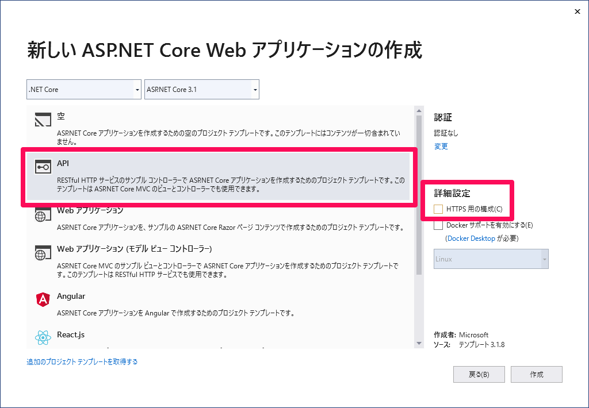
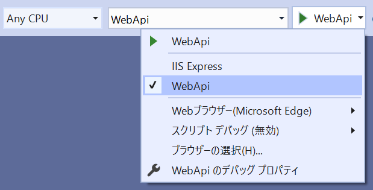
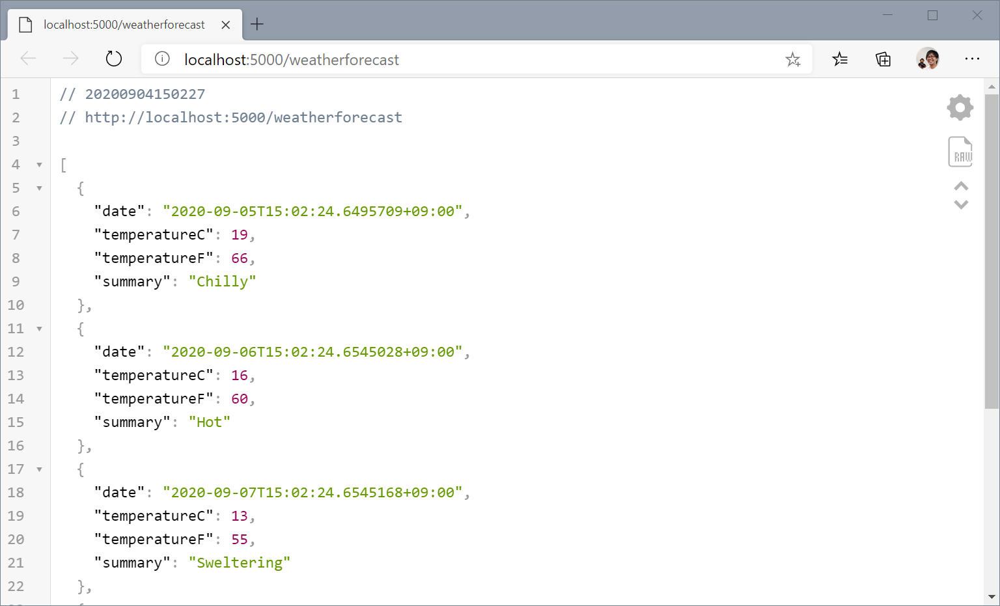

##


## システム要件


## Web API を作成

ローカルデバッグ用に .NET Core の Web API を作成します。

- API を選択します。
- `HTTPS 用の構成` のチェックを外します。
- 本ドキュメントでは「WebApi」と名前を付けました。



> 通常 Web にデプロイする Web アプリケーションは HTTPS で動作するように設定すべきですが、Android Emulator から localhost の Web サービスにアクセスするには `10.0.2.2` を指定する必要があり、かつ、[iOS シミュレーターと Android エミュレーターからローカル Web サービスに接続する \- Xamarin \| Microsoft Docs](https://docs.microsoft.com/ja-jp/xamarin/cross-platform/deploy-test/connect-to-local-web-services) に記載されているようにいくつかの処理を行う必要があるため、簡素化するために HTTP で通信できるようにしています。
> 
> 接続する Web アプリケーションが HTTPS に対応していない場合は、[Android P で targetSdkVersion を 28 に指定した場合に HTTP 通信が失敗する \- Xamarin 日本語情報](https://blog.ytabuchi.dev/entry/2019/08/26/180000) を参考に `network-security-config` を指定するか `usesCleartextTraffic` を指定してください。

作成後、スタートアッププロジェクトが「WebApi」になっていること、デバッグプロパティが「WebApi」になっていることを確認し、デバッグボタン「▶」をクリックします。



指定している Web ブラウザーでデバッグできることを確認してください。




詳しくは解説しませんが、`WebApi/Properties/launchSettings.json` の以下の設定により `http://localhost:5000/weatherforecast` でデバッグできます。

```json
"WebApi": {
  "commandName": "Project",
  "launchBrowser": true,
  "launchUrl": "weatherforecast",
  "applicationUrl": "http://localhost:5000",
  "environmentVariables": {
    "ASPNETCORE_ENVIRONMENT": "Development"
  }
}
```

また、`WebApi/Controllers/WeatherForecastController.cs` の以下のコードでアクセスするたびにランダムに天気の予測を返していることが分かります。

```csharp
public IEnumerable<WeatherForecast> Get()
{
    var rng = new Random();
    return Enumerable.Range(1, 5).Select(index => new WeatherForecast
    {
        Date = DateTime.Now.AddDays(index),
        TemperatureC = rng.Next(-20, 55),
        Summary = Summaries[rng.Next(Summaries.Length)]
    })
    .ToArray();
}
```

デバッグ実行中のブラウザをリロードすると毎回気温の値が変化するのが分かります。


## Xamarin.Forms プロジェクトを作成


