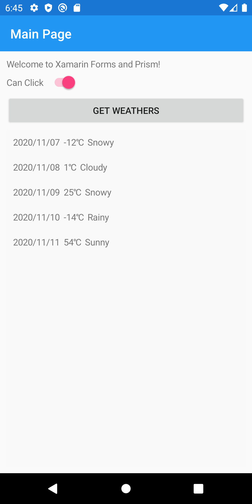

# Prism hands on lab

このドキュメントでは Prism for Xamarin.Forms を利用した MVVM によるモバイルアプリ開発をハンズオンで学習します。

開発するのは Web API に接続し、データを表示するモバイルアプリです。

## システム要件

- 最新の Windows または macOS
- 最新の Visual Studio 2019 または Visual Studio for Mac
    - Prism 拡張機能
- Android SDK
    - Android Emulator

### Prism 拡張機能のインストール

Visual Studio のメニューから「拡張機能＞拡張機能の管理」で表示されるダイアログの「オンライン」タブが選択されている状態で右上の検索窓に `prism` と入力して「Prism Template Pack」をインストールします。


## Xamarin.Forms アプリの作成と動作確認

Visual Studio を起動して「新しいプロジェクト」をクリックします。


ダイアログで検索窓に `prism` と入力し、「Prism Blank App (Xamarin.Forms)」をクリックして Prism での Xamarin.Forms プロジェクトを作成します。


任意の名前でプロジェクトを作成します。（本ドキュメントでは `MobileApp` という名前空間ですので合わせても良いでしょう。）


今回は UWP はチェックせずに、Container は「Unity」を使用します。


### 最初の起動

`MobileApp.Android` を右クリックして「スタートアッププロジェクトに設定」をクリックするか、「スタートアッププロジェクト」のドロップダウンから `MobileApp.Android` を選択します。

すると、接続している Android デバイスや利用できる Android エミュレーターをドロップダウンから選択してデバッグ実行ができます。

「Android Emulator」としか表示されていない場合は、新規にエミュレーターを作成する必要があります。


#### Android エミュレーターの作成

ドロップダウンから「Android デバイスマネージャー」をクリックします。

表示されるダイアログで「新規」ボタンをクリックします。

表示されるダイアログで適切な設定で Android エミュレーターを作成してください。

- 基本デバイス：デバイスのテンプレートでデバイスに応じた画面サイズやメモリ量が決まります。`Pixel 3` や `Pixel 3a` などを選んでおくと良いでしょう。
- プロセッサ：`x86` か `x86_64` を選択します。（Intel CPU の仮想化に Hyper-V または Intel HAXM が必要です。）
- OS：エミュレーターの OS を指定します。
- Google APIs／Google Play Store：Google Play Store にチェックを付けると Emulator でマップやストアが利用できます。


各種選択した状態で「新しいデバイスイメージがダウンロードされます。」という注意書きがある場合は、Android SDK のダウンロードサイトから条件に見合った OS イメージを自動でダウンロードしてエミュレーターを作成します。

OS イメージは Visual Studio のメニューから「ツール＞Android＞Android SDK マネージャー」をクリックし、


表示されるダイアログで `Google APIs Intel x86 Atom System Image` や `Google Play Intel x86 Atom System Image` が該当します。少し大きいサイズなので、PC の空き容量が少ない場合は選択してインストールしてください。


#### デバッグ実行

準備が整ったところで最初のデバッグ実行をしてみましょう。

Android エミュレーターが起動して、次のような画面が表示されれば OK です。


### デフォルトプロジェクトの構成

<pre>
+ MobileApp
  + ViewModels
    - MainPageViewModel.cs
    - ViewModelBase.cs
  + Views
    - MainPage.xaml / MainPage.xaml.cs
  - App.xaml / App.xaml.cs
</pre>

#### `App.xaml.cs`

エントリーポイントです。`RegisterTypes` メソッド内で、アプリでのナビゲーションに使用する View と ViewModel の紐づけ登録などを行います。

```csharp
protected override void RegisterTypes(IContainerRegistry containerRegistry)
{
    containerRegistry.RegisterSingleton<IAppInfo, AppInfoImplementation>();

    containerRegistry.RegisterForNavigation<NavigationPage>();
    containerRegistry.RegisterForNavigation<MainPage, MainPageViewModel>();
}
```

ここで View の `MainPage` クラスと ViewModel の `MainPageViewModel` クラスが紐づいていることが分かります。

#### `ViewModelBase.cs`

ViewModel の基礎クラスです。ViewModel の基本となるイベントの通知機構（バインディング）を提供する `System.ComponentModel.INotifyPropertyChanged` を継承した `BindableBase` を継承しています。

`PropertyChangedEventHandler` イベントや `OnPropertyChanged` メソッドに加え、`Title` プロパティ、ナビゲーションを担う `INavigationService` や View が遷移してきたときに発火する `OnNavigatedTo` メソッドなどが用意されています。

#### `MainPageViewModel.cs`

`MainPage` と紐づいている ViewModel です。`ViewModelBase` で用意している `INavigationService` をそのまま利用するためコンストラクターは以下のような記述になっています。

```csharp
public MainPageViewModel(INavigationService navigationService)
    : base(navigationService)
```

#### `MainPage.xaml`

View のクラスです。XML ベースのクラスを表す言語 XAML で記述します。要素（Element）がインスタンスを表し、属性（Attribute）がプロパティなどを表します。

```xml
<?xml version="1.0" encoding="utf-8" ?>
<ContentPage xmlns="http://xamarin.com/schemas/2014/forms"
             xmlns:x="http://schemas.microsoft.com/winfx/2009/xaml"
             x:Class="MobileApp.Views.MainPage"
             Title="{Binding Title}">

    <StackLayout HorizontalOptions="CenterAndExpand" VerticalOptions="CenterAndExpand">
        <Label Text="Welcome to Xamarin Forms and Prism!" />
    </StackLayout>

</ContentPage>
```

#### `MainPage.xaml.cs`

MainPage のパーシャルクラスです。`InitializeComponent` メソッドだけが記述されているケースが多いです。


起動確認は以上です。


## Web API への接続

起動を確認したら、Web API への接続を追加しましょう。

今回は Visual Studio の ASP.NET Core Web アプリケーションの API で作成されるテンプレートアプリをそのまま https://weatherforecastsampleforprism.azurewebsites.net/weatherforecast にアップロードしてあります。（時間があれば同じものをローカルホストで動かします。）URL にアクセスして表示される JSON を見てみましょう。

```json
[
  {
    date: "2020-10-16T03:22:30.9605433+00:00",
    temperatureC: 36,
    temperatureF: 96,
    summary: "Hot",
  },
  {
    date: "2020-10-17T03:22:30.9615198+00:00",
    temperatureC: 19,
    temperatureF: 66,
    summary: "Hot",
  },
  {
    date: "2020-10-18T03:22:30.9615238+00:00",
    temperatureC: -9,
    temperatureF: 16,
    summary: "Freezing",
  },
  {
    date: "2020-10-19T03:22:30.9615244+00:00",
    temperatureC: -7,
    temperatureF: 20,
    summary: "Hot",
  },
  {
    date: "2020-10-20T03:22:30.9615248+00:00",
    temperatureC: 26,
    temperatureF: 78,
    summary: "Mild",
  },
]
```


### モデルクラスの作成

まずはこの JSON をオブジェクトとして操作するための Model クラスを作成します。

事前に Web API から表示されている JSON をクリップボードにコピーしておきます。

**Xamarin.Forms プロジェクト**での作業です

`Models` フォルダを作成します。

`Models` フォルダを右クリックして「追加＞クラス」から `Weather` クラスを作成します。

作成されたクラスを開いた状態で Visual Studio のメニューから「編集＞形式を選択して張り付け＞JSON として張り付ける」を選択します。

`Class1` として生成されたプロパティを `Weather` クラスのプロパティとして設定します。`public` 属性を付け、プロパティ名をアッパーキャメルケースにします。JSON はキャメルケースのため、使用する `Newtonsoft.Json` で用意されている属性を追加します。次のようになります。

```csharp
public class Weather
{
    [JsonProperty("date")]
    public DateTime Date { get; set; }
    [JsonProperty("temperatureC")]
    public int TemperatureCelsius { get; set; }
    [JsonProperty("temperatureF")]
    public int TemperatureFahrenheit { get; set; }
    [JsonProperty("summary")]
    public string Summary { get; set; }
}
```

`Newtonsoft.Json` は、IntelliSnese から自動インストールすることも可能ですし、


Xamarin.Forms プロジェクトを右クリックから「NuGet パッケージの管理」を選択して、手動で `Newtonsoft.Json` をインストールすることも可能です。


> TIPS: JSON ライブラリについて
> 
> 一般的な .NET Core 3.1 のアプリケーションでは標準で含まれる `System.Text.Json` を使うのが良いでしょう。
> 
> 今まで `Newtonsoft.Json` を利用していた場合は、公式ドキュメント [Newtonsoft\.Json から System\.Text\.Json に移行する \- \.NET \| Microsoft Docs](https://docs.microsoft.com/ja-jp/dotnet/standard/serialization/system-text-json-migrate-from-newtonsoft-how-to) などを参考に移行できます。
> 
> Xamarin での利用については [System\.Text\.Json Serializer does not appear to work on Xamarin iOS · Issue \#31326 · dotnet/runtime · GitHub](https://github.com/dotnet/runtime/issues/31326) にあるように 2020/9/9 の時点でもまだ `System.Numerics.Vectors` でコンフリクトが発生しているというワーニングが発生するようなので、安全のために `Newtonsoft.Json` を使用しています。


### サービスのインターフェイスと実装クラスの作成

次に Web API からデータを取得するインターフェイスと実装を作成します。

`Services` フォルダを作成します。

`Services` フォルダを右クリックして「追加＞新しい項目」から「インターフェイス」を選択し、`IWeaterService` を作成します。


`IWeaterService.cs` で、インターフェイスを `public` 属性にして、`Weather` のコレクションを戻り値に持つ `GetWeathersAsync` メソッドを追加します。次のようになります。

```csharp
public interface IWeaterService
{
    Task<ObservableCollection<Weather>> GetWeathersAsync();
}
```

不足する using は IntelliSnese で追加できます。


インターフェイスはこれで完了です。続いてインターフェイスの実装を作成します。


`Services` フォルダを右クリックして「追加＞クラス」から `WeatherService` クラスを作成します。


`WeatherService.cs` クラスに `IWeatherService` の継承を追加し、内容を次のように書き換えます。

```csharp
class WeatherService : IWeatherService
{
    static HttpClient _httpClient = new HttpClient();

    public async Task<ObservableCollection<Weather>> GetWeathersAsync()
    {
        try
        {
            // サイトからデータを取得
            var response = await _httpClient.GetAsync("https://weatherforecastsampleforprism.azurewebsites.net/weatherforecast");
            // レスポンスコード（200 など）を確認
            response.EnsureSuccessStatusCode();
                
            // レスポンスからコンテンツ（JSON）を取得
            var json = await response.Content.ReadAsStringAsync();
            // Newtonsoft.Json で JSON をデシリアライズ
            return JsonConvert.DeserializeObject<ObservableCollection<Weather>>(json);
        }
        catch (Exception ex)
        {
            Debug.WriteLine(ex.Message);
            return null;
        }
    }
}
```

不足する using は IntelliSnese で追加できます。

`WeatherService` はこれで完了です。


### コンテナーへの登録

インターフェイスと実装クラスを追加したので、Prism に教える必要があります。

`App.xaml.cs` を開き、`RegisterTypes` メソッド内に次のコードを追加します。

```csharp
containerRegistry.RegisterSingleton<IWeatherService, WeatherService>();
```

コンテナーへの登録はこれで完了です。


### ViewModel の実装

続いて ViewModel の実装を行います。`MainPageViewModel.cs` を開きます。

コンストラクターの引数に `IWeatherService` を追加し、プロパティを追加します。次のようになります。


```csharp
private readonly IWeatherService _weatherService;

public MainPageViewModel(INavigationService navigationService,
                         IWeatherService weatherService)
    : base(navigationService)
{
    Title = "Main Page";
    _weatherService = weatherService;
}
```

次に View から参照するプロパティをコンストラクターの上に 2つ追加します。

```csharp

public ObservableCollection<Weather> Weathers { get; set; } = new ObservableCollection<Weather>();

private bool canClick = true;
public bool CanClick
{
    get { return canClick; }
    set { SetProperty(ref canClick, value); }
}
```

> TIPS: コードスニペット
> 
> Prism ではバッキングフィールドと連動した公開プロパティを使用します。Visual Studio にインストールした「Prism Template」に、この 2つのプロパティを作成する `propp` のコードスニペットが含まれていますので適宜利用してください。


次にコンストラクターの上に `DelegateCommand` を追加し、コマンドから呼び出されるメソッドをコンストラクターの下に追加します。

コマンド：

```csharp
public DelegateCommand GetWeathersCommand { get; private set; }
```

メソッド：

```csharp
private async Task GetWeathersAsync()
{
    CanClick = false;

    Weathers.Clear();
    // サービスの GetWeathersAsync メソッドをコールし、一時的に保存
    var tempWeathers = await _weatherService.GetWeathersAsync();
    // View から参照できるようにプロパティに流し込み
    if (tempWeathers != null)
    {
        foreach (var weather in tempWeathers)
        {
            Weathers.Add(weather);
        }
    }

    CanClick = true;
}
```

次にコンストラクター内でコマンドにメソッドを割り当てます。コンストラクター全体は次のようになります。

```csharp
public MainPageViewModel(INavigationService navigationService,
                         IWeatherService weatherService)
    : base(navigationService)
{
    Title = "Main Page";
    _weatherService = weatherService;

    GetWeathersCommand = new DelegateCommand(
        async () => await GetWeathersAsync(),
        () => CanClick)
        .ObservesCanExecute(() => CanClick);
}
```

`DelegateCommand` の引数は `Action executeMethod, Func<bool> canExecuteMethod` のため、`GetWeathersAsync` 呼び出し、`CanClick` 参照を行っています。最後の `ObservesCanExecute(Expression<Func<bool>> canExecuteExpression)` は Prism 独自の機能で、影響を受けるプロパティを指定できるため、プロパティをプレーンに保つことができます。

`ObservesCanExecure` を使用しない場合は、プロパティのセッターにどのコマンドに実行可能の変更を伝えるか？を記述します。次のようになります。

```csharp
private bool canClick;
public bool CanClick
{
    get { return canClick; }
    set
    {
        SetProperty(ref canClick, value);
        GetWeathersCommand.RaiseCanExecuteChanged();
    }
}
```


最後にこの View を表示した際にメソッドを実行できるように `OnNavigatedTo` の `override` を追加します。

```csharp
public override async void OnNavigatedTo(INavigationParameters parameters)
{
    base.OnNavigatedTo(parameters);
    await GetWeathersAsync();
}
```


ViewModel は全体では次のようになっています。

```csharp
public class MainPageViewModel : ViewModelBase
{
    private readonly IWeatherService _weatherService;

    public ObservableCollection<Weather> Weathers { get; set; } = new ObservableCollection<Weather>();

    private bool canClick = true;
    public bool CanClick
    {
        get { return canClick; }
        set { SetProperty(ref canClick, value); }
    }

    public DelegateCommand GetWeathersCommand { get; private set; }

    public MainPageViewModel(INavigationService navigationService,
                                IWeatherService weatherService)
        : base(navigationService)
    {
        Title = "Main Page";
        _weatherService = weatherService;

        GetWeathersCommand = new DelegateCommand(
            async () => await GetWeathersAsync(),
            () => CanClick)
            .ObservesCanExecute(() => CanClick);
    }

    public override async void OnNavigatedTo(INavigationParameters parameters)
    {
        base.OnNavigatedTo(parameters);
        await GetWeathersAsync();
    }

    private async Task GetWeathersAsync()
    {
        CanClick = false;

        Weathers.Clear();
        // サービスの GetWeathersAsync メソッドをコールし、一時的に保存
        var tempWeathers = await _weatherService.GetWeathersAsync();
        // View から参照できるようにプロパティに流し込み
        if (tempWeathers != null)
        {
            foreach (var weather in tempWeathers)
            {
                Weathers.Add(weather);
            }
        }

        CanClick = true;
    }
}
```


これで ViewModel は完成です。


### View の作成

最後に View を作成していきましょう。`MainPage.xaml` を開きます。

`StackLayout` の `HorizontalOptions`／`VerticalOptions` を削除し、`Padding=10` に置き換えます。`Label` の下に `Switch` と ViewModel で用意したコマンドを呼び出す `Button` を追加します。次のようになります。

```xml
<StackLayout Padding="10">
    <Label Text="Welcome to Xamarin Forms and Prism!" />
    <StackLayout Orientation="Horizontal">
        <Label Text="Can Click" VerticalTextAlignment="Center" />
        <Switch IsToggled="{Binding CanClick}" />
    </StackLayout>
    <Button Command="{Binding GetWeathersCommand}" Text="Get Weathers" />
</StackLayout>
```

エディタ下部の「<<」ボタンをクリックすると XAML プレビューアーが表示されますが、「XAML ホットリロード」の機能を使用した方が早いかもしれません。


プレビューアーについての詳細は [XAML プレビューアー Xamarin\.Forms \- Xamarin \| Microsoft Docs](https://docs.microsoft.com/ja-jp/xamarin/xamarin-forms/xaml/xaml-previewer/?pivots=windows) を参照してください。

XAML ホットリロードについての詳細は [XAML ホットリロード Xamarin\.Forms \- Xamarin \| Microsoft Docs](https://docs.microsoft.com/ja-jp/xamarin/xamarin-forms/xaml/hot-reload)


この時点でデバッグ実行してみましょう。View を表示した際とボタンをクリックした際にスイッチとボタンが連動して動作するのが分かるはずです。


`MainPageViewModel` や `WeatherService` にブレークポイントを貼ると処理の内容を確認できます。


#### CollectionView の利用

ブレークポイントで Web API からデータが取得できていることが確認できたら、取得したデータを表示する `CollectionView` を追加します。

`StackLayout` 内の一番下（`Button` の下）に次を追加します。

```xml
<CollectionView ItemsSource="{Binding Weathers}" 
                ItemsLayout="VerticalGrid, 2">
    <CollectionView.ItemTemplate>
        <DataTemplate>
                    
        </DataTemplate>
    </CollectionView.ItemTemplate>
</CollectionView>
```

`CollectionView` の詳細は [Xamarin\.Forms CollectionView \- Xamarin \| Microsoft Docs](https://docs.microsoft.com/ja-jp/xamarin/xamarin-forms/user-interface/collectionview/) を参照してください。

特に `ItemsLayout` プロパティで以下の表示方法を利用できます。今回は縦方向の 2列のグリッドを使用しています。

- 縦方向のリスト
- 横方向のリスト
- 縦方向のグリッド
- 横方向のグリッド

Layout の詳細は [Xamarin\.Forms CollectionView レイアウト \- Xamarin \| Microsoft Docs](https://docs.microsoft.com/ja-jp/xamarin/xamarin-forms/user-interface/collectionview/layout) を参照してください。

`CollectionView` の `DataTemplate` 内には自由にレイアウトを作成できます。次の XAML を追加してください。

```xml
<Grid Padding="10">
    <Grid.RowDefinitions>
        <RowDefinition Height="Auto" />
        <RowDefinition Height="Auto" />
        <RowDefinition Height="Auto" />
    </Grid.RowDefinitions>
    <Label Grid.Row="0"
           HorizontalTextAlignment="Center"
           Text="{Binding Date, StringFormat='{}{0:yyyy/MM/dd}'}" />
    <Label Grid.Row="1"
           HorizontalTextAlignment="Center"
           Text="{Binding TemperatureCelsius, StringFormat='{0}℃'}" />
    <Label Grid.Row="2"
           HorizontalTextAlignment="Center"
           Text="{Binding Summary}" />
</Grid>
```

次のような画面が表示されれば OK です。



日付や温度の表示方法を変更するために、`StringFormat` を使用しています。`StringFormat` の詳細は [Xamarin\.Forms の文字列の書式設定 \- Xamarin \| Microsoft Docs](https://docs.microsoft.com/ja-jp/xamarin/xamarin-forms/app-fundamentals/data-binding/string-formatting) を参照してください。


#### 天気アイコンの表示

文字だけだと寂しいので、天気をアイコンで表示してみましょう。画像を表示するには `Image` クラスを利用します。

`Image` クラスの重要なプロパティに [Image\.Source プロパティ \(Xamarin\.Forms\) \| Microsoft Docs](https://docs.microsoft.com/ja-jp/dotnet/api/xamarin.forms.image.source?view=xamarin-forms#Xamarin_Forms_Image_Source) があります。

ImageSource インスタンスは、イメージソースの種類ごとに静的メソッドを使用して取得できます。

- FromFile - 各プラットフォームで解決できるファイル名またはファイルパスが必要です。
- FromUri - Uri オブジェクトが必要です。例: `new Uri("http://server.com/image.jpg")`
- FromResource - ビルドアクション EmbeddedResource を使用して、アプリケーションまたは .NET Standard ライブラリプロジェクトに埋め込まれているイメージファイルのリソース識別子が必要です。
- FromStream - イメージデータを提供するストリームが必要です。

詳細は [Image in Xamarin\.Forms \- Xamarin \| Microsoft Docs](https://docs.microsoft.com/ja-jp/xamarin/xamarin-forms/user-interface/images?tabs=windows) を参照してください。

`FromResource` は .NET Standard プロジェクトに 1つだけ画像ファイルを用意すれば良いため、アプリケーションで固定のアイコンなどを利用する場合に便利です。

今回はファイル名をバインドするため、各 OS プロジェクトに画像を配置します。


#### Android プロジェクトに画像を追加


Android プロジェクトを開き、「Resources/drawable」にダウンロードした「Resources」フォルダ内の 5つの png ファイルをドラッグ＆ドロップして追加します。


画像を選択し、プロパティウィンドウでビルドアクションが「AndroidResource」になっていることを確認してください。


Xamarin.Forms プロジェクトに移動し、`MainPage.xaml` を開きます。

`Label` が 3つ並んでいる `Grid` の一番上に `Image` を追加します。

```xml
<Image Grid.Row="0"
       Grid.RowSpan="3"
       WidthRequest="120"
       HeightRequest="120"
       Source="{Binding Summary, StringFormat='{0}.png'}" />
```

再度ビルドしてみましょう。次のようになれば OK です。


#### 選択の追加

選択して、各項目を表示するページに遷移してみましょう。

標準で `CollectionView` は選択が無効になっています。`MainPage.xaml` の `CollectionView` のプロパティに次を追加します。

```xml
SelectionMode="Single"
SelectionChanged="OnCollectionViewSelectionChanged"
```


## Web API を作成

ローカルデバッグ用に .NET Core の Web API を作成します。

- API を選択します。
- `HTTPS 用の構成` のチェックを外します。
- 本ドキュメントでは「WebApi」と名前を付けました。


> 通常 Web にデプロイする Web アプリケーションは HTTPS で動作するように設定すべきですが、Android Emulator から localhost の Web サービスにアクセスするには `10.0.2.2` を指定する必要があり、かつ、[iOS シミュレーターと Android エミュレーターからローカル Web サービスに接続する \- Xamarin \| Microsoft Docs](https://docs.microsoft.com/ja-jp/xamarin/cross-platform/deploy-test/connect-to-local-web-services) に記載されているようにいくつかの処理を行う必要があるため、簡素化するために HTTP で通信できるようにしています。
> 
> 接続する Web アプリケーションが HTTPS に対応していない場合は、[Android P で targetSdkVersion を 28 に指定した場合に HTTP 通信が失敗する \- Xamarin 日本語情報](https://blog.ytabuchi.dev/entry/2019/08/26/180000) を参考に `network-security-config` を指定するか `usesCleartextTraffic` を指定してください。

作成後、スタートアッププロジェクトが「WebApi」になっていること、デバッグプロパティが「WebApi」になっていることを確認し、デバッグボタン「▶」をクリックします。


指定している Web ブラウザーでデバッグできることを確認してください。


詳しくは解説しませんが、`WebApi/Properties/launchSettings.json` の以下の設定により `http://localhost:5000/weatherforecast` でデバッグできます。

```json
"WebApi": {
  "commandName": "Project",
  "launchBrowser": true,
  "launchUrl": "weatherforecast",
  "applicationUrl": "http://localhost:5000",
  "environmentVariables": {
    "ASPNETCORE_ENVIRONMENT": "Development"
  }
}
```

また、`WebApi/Controllers/WeatherForecastController.cs` の以下のコードでアクセスするたびにランダムに天気の予測を返していることが分かります。

```csharp
public IEnumerable<WeatherForecast> Get()
{
    var rng = new Random();
    return Enumerable.Range(1, 5).Select(index => new WeatherForecast
    {
        Date = DateTime.Now.AddDays(index),
        TemperatureC = rng.Next(-20, 55),
        Summary = Summaries[rng.Next(Summaries.Length)]
    })
    .ToArray();
}
```

デバッグ実行中のブラウザをリロードすると毎回気温の値が変化するのが分かります。


## Appendix

### .NET MAUI について

1つのプロジェクトからマルチプラットフォームにビルドできます。

MVVM だけでなく、Swift UI や Flutter のような Model-View-Update (MVU) パターンをサポートします。

```csharp
readonly State<int> count = 0;

[Body]
View body() => new StackLayout
{
    new Label("Welcome to .NET MAUI!"),
    new Button(
        () => $"You clicked {count} times.",
        () => count.Value ++)
    )
};
```

同じ内容を MVVM の XAML とコードで記述する場合は以下のようになります。

```xml
<StackLayout>
    <Label Text="Welcome to .NET MAUI!" />
    <Button Text="{Binding Text}" 
            Command="{Binding ClickCommand}" />
</StackLayout>
```

```csharp
public Command ClickCommand { get; }

public string Text { get; set; } = "Click me";

int count = 0;

void ExecuteClickCommand ()
{
    count++;
    Text = $"You clicked {count} times.";
}
```

詳細は以下を参照してください。

- [\.NET MAUIって何？ \- nuits\.jp blog](https://www.nuits.jp/entry/what-is-maui)
- [Introducing \.NET Multi\-platform App UI \| \.NET Blog](https://devblogs.microsoft.com/dotnet/introducing-net-multi-platform-app-ui/)


